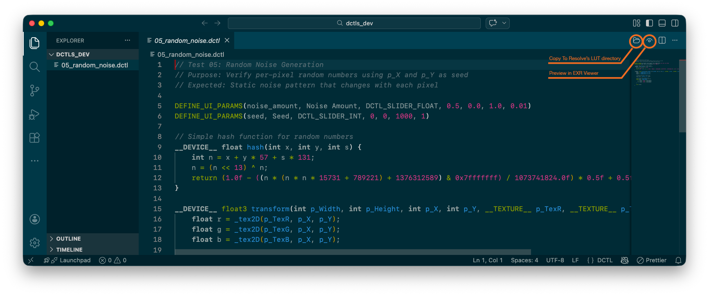

# DCTL Workbench

**DCTL Workbench** is a comprehensive development environment for DaVinci Color Transform Language (DCTL), featuring a VS Code extension, a CLI tool, and a core runtime library.

## What is DCTL?

DCTL (DaVinci Color Transform Language) is a shader-like language used in [DaVinci Resolve](https://www.blackmagicdesign.com/products/davinciresolve) for creating custom color transformations, LUTs, and visual effects. It is similar to CUDA/OpenCL and allows colorists and developers to create sophisticated color grading tools.

DCTL Workbench provides a complete development environment for writing, testing, and previewing DCTL effects outside of DaVinci Resolve, with full ACES color pipeline support.



## Features

### VS Code Extension

- **DCTL Language Support**
  - Syntax highlighting with TextMate grammar
  - Code snippets for common DCTL patterns
  - Real-time diagnostics and error checking
  - Hover information and IntelliSense
  - Preprocessor support (`#include`, `#define`, `#if`)

- **EXR Viewer**
  - Native OpenEXR file viewing in VS Code
  - Zoom and pan navigation
  - Metadata display (chromaticities, compression, etc.)

- **Real-time DCTL Preview**
  - Live preview of DCTL effects on EXR images
  - WebGPU/WebGL2 accelerated rendering
  - Automatic update on file changes
  - Interactive UI parameter controls (sliders, checkboxes, combos)

- **ACES Color Pipeline**
  - Full ACES 2.0 workflow
  - ACES 2.0 Reference Gamut Compression (RGC) support
  - Working color space options (ACES2065-1, ACEScg, ACEScc, ACEScct, Linear sRGB)
  - Display transforms via OpenColorIO

### CLI Tool

- **Batch Processing**
  - Apply DCTL effects to EXR images from command line
  - WebGPU-accelerated compute shader execution
  - Scriptable for automation and pipelines

- **Color Space Support**
  - Input/output color space conversion
  - ACES RGC integration
  - Multiple working color space options

- **Developer Tools**
  - Compile DCTL to WGSL for debugging
  - View DCTL file information and parameters

### Core Library

- **DCTL Compiler**
  - TypeScript parser with full preprocessor
  - Rust-based WGSL code generator (via WASM)
  - UI parameter extraction (`DEFINE_UI_PARAMS`)

- **EXR I/O**
  - Read/write OpenEXR files via WASM
  - All standard compression formats
  - ACES chromaticities support

- **Color Science**
  - AP0 ↔ AP1 matrix conversions
  - ACEScct/ACEScc transfer functions
  - OpenColorIO integration

## Supported Formats

### Color Spaces

| Color Space           | Description              | Usage            |
|-----------------------|--------------------------|------------------|
| `AP0` (ACES 2065-1)   | ACES primary color space | Input/Output     |
| `AP1` (ACEScg)        | ACES working color space | Working          |
| `ACEScct`             | Log encoding for AP1     | Working (default)|
| `ACEScc`              | Log encoding for AP1     | Working          |
| `sRGB`                | Standard RGB             | Input/Output     |
| `Rec709`              | HD broadcast             | Input/Output     |

### EXR Compression

| Format        | Description                | Use Case                 |
|---------------|----------------------------|--------------------------|
| `PIZ`         | Wavelet-based lossless     | General purpose (default)|
| `ZIP`         | Deflate per scanline block | Good compression         |
| `ZIPS`        | Deflate per scanline       | Fast decompression       |
| `RLE`         | Run-length encoding        | Simple scenes            |
| `PXR24`       | Lossy 24-bit               | Reduced precision        |
| `DWAA`        | Lossy DCT-based            | VFX plates               |
| `DWAB`        | Lossy DCT-based (blocks)   | VFX plates               |
| `B44` / `B44A`| Lossy fixed-rate           | Real-time playback       |
| `NONE`        | No compression             | Maximum speed            |

### EXR Pixel Types

| Type    | Bits   | Description           |
|---------|--------|-----------------------|
| `HALF`  | 16-bit | Half-precision float  |
| `FLOAT` | 32-bit | Full-precision float  |
| `UINT`  | 32-bit | Unsigned integer      |

## Installation

### Prerequisites

#### Required

- **Node.js** (v18 or higher) - JavaScript runtime
- **Rust** (latest stable) - For compiling WASM modules
- **Emscripten** - Installed automatically via `npm run setup:deps`

#### Optional

- **GitHub CLI (`gh`)** - For checking dependency updates

  ```bash
  brew install gh
  ```

### Build from Source

```bash
# Clone the repository
git clone https://github.com/your-org/dctl-workbench.git
cd dctl-workbench

# Install Node.js dependencies
npm install

# Setup external dependencies (C++ libraries, Emscripten)
npm run setup:deps

# Build all packages
npm run build
```

### Individual Builds

```bash
npm run build:wasm      # WASM modules (Rust + C++)
npm run build:core      # Core library
npm run build:cli       # CLI tool
npm run build:vscode    # VS Code extension
```

## Usage

### VS Code Extension

1. Open the repository in VS Code
2. Press `F5` to launch the Extension Development Host
3. Open a `.dctl` file to use language features
4. Open a `.exr` file to use the EXR viewer
5. Use the preview panel to see DCTL effects in real-time

#### Settings

**EXR Viewer** (`dctlWorkbench.exr_viewer.*`)

| Setting | Default | Description |
|---------|---------|-------------|
| `defaultWorkingColorSpace` | `ACEScct` | Default working color space (can be changed per viewer) |
| `defaultExportCompression` | `PIZ` | Default EXR export compression method |

**Editor** (`dctlWorkbench.editor.*`)

| Setting | Default | Description |
|---------|---------|-------------|
| `diagnostics` | `true` | Enable DCTL syntax checking and diagnostics |
| `diagnosticsDebounceMs` | `500` | Debounce time for diagnostics update (ms) |
| `nagaValidation` | `true` | Enable Naga (WGSL) validation in addition to syntax checking |
| `resolveDctlDirectory` | *(empty)* | Path to DaVinci Resolve DCTL directory |

### CLI Tool

#### Apply DCTL Effect

```bash
# Basic usage
dctlw apply effect.dctl input.exr output.exr

# With parameters
dctlw apply effect.dctl input.exr output.exr -p gain=1.5 -p saturation=1.2

# With color space options
dctlw apply effect.dctl input.exr output.exr \
  --input-space AP0 \
  --output-space AP0 \
  --working-space ACEScct

# With ACES 2.0 RGC
dctlw apply effect.dctl input.exr output.exr \
  --rgc \
  --peak-luminance 1000

# With include directories
dctlw apply effect.dctl input.exr output.exr \
  --include ./includes --include ./libs
```

#### CLI Options (apply command)

| Option                        | Default   | Description                                       |
|-------------------------------|-----------|---------------------------------------------------|
| `-p, --param <name=value>`    | -         | Set parameter value (repeatable)                  |
| `-i, --input-space <space>`   | `AP0`     | Input color space                                 |
| `-o, --output-space <space>`  | `AP0`     | Output color space                                |
| `-w, --working-space <space>` | `ACEScct` | Working color space for DCTL                      |
| `--rgc`                       | `false`   | Enable ACES 2.0 Reference Gamut Compression       |
| `--peak-luminance <nits>`     | `100`     | Peak luminance for RGC (100/500/1000/2000/4000)   |
| `--include <dir>`             | -         | Additional include directories (repeatable)       |

#### Compile DCTL to WGSL

```bash
# Output to stdout
dctlw compile effect.dctl

# Output to file
dctlw compile effect.dctl -o effect.wgsl

# With include directories
dctlw compile effect.dctl --include ./includes
```

#### Show DCTL Information

```bash
dctlw info effect.dctl
```

Example output:

```text
File: effect.dctl
WGSL size: 2048 chars
Parameters: 3

UI Parameters:
  gain: Gain
    Type: float
    Default: 1.0
    Range: 0.0 - 4.0
  saturation: Saturation
    Type: float
    Default: 1.0
    Range: 0.0 - 2.0
  invert: Invert
    Type: bool
    Default: false
```

### Core Library (API)

```typescript
import { DctlRuntime, isCompileError } from '@dctl-workbench/core';

// Initialize runtime
const runtime = new DctlRuntime();
await runtime.init({ wasmPath: './wasm' });

// Compile DCTL
const result = await runtime.compile(dctlSource);
if (isCompileError(result)) {
  console.error('Compilation failed:', result.message);
} else {
  console.log('WGSL:', result.wgsl);
  console.log('Parameters:', result.parameters);
}

// Read EXR
const exr = await runtime.readExr('input.exr');
console.log(`${exr.width}x${exr.height}, channels: ${exr.channels}`);

// Write EXR
await runtime.writeExr('output.exr', {
  width: 1920,
  height: 1080,
  data: pixelData,
  compression: 'PIZ',
  aces: true,  // Use ACES AP0 chromaticities
});
```

## DCTL Language Support

### Supported Features

- **Data Types**: `int`, `float`, `bool`, `float2`, `float3`, `float4`, `mat3`, `mat4`
- **Functions**: User-defined functions, built-in math functions
- **Control Flow**: `if`/`else`, `for`, `while`, `switch`
- **Operators**: Arithmetic, comparison, logical, bitwise
- **Preprocessor**: `#include`, `#define`, `#if`, `#ifdef`, `#ifndef`, `#else`, `#endif`
- **UI Parameters**: `DEFINE_UI_PARAMS` for interactive controls

### UI Parameter Types

```c
// Float slider
DEFINE_UI_PARAMS(gain, Gain, DCTL_UI_SLIDER_FLOAT, 1.0, 0.0, 4.0, 0.01)

// Integer slider
DEFINE_UI_PARAMS(mode, Mode, DCTL_UI_SLIDER_INT, 0, 0, 3, 1)

// Checkbox
DEFINE_UI_PARAMS(invert, Invert, DCTL_UI_CHECK_BOX, 0)

// Combo box
DEFINE_UI_PARAMS(method, Method, DCTL_UI_COMBO_BOX, 0, {Linear, Cubic, Catmull-Rom})
```

### Transform Function Signatures

DCTL Workbench supports two transform function signatures:

```c
// Texture-based (uses internal texture sampling)
__DEVICE__ float3 transform(int p_Width, int p_Height, int p_X, int p_Y,
                            __TEXTURE__ p_TexR, __TEXTURE__ p_TexG, __TEXTURE__ p_TexB)

// Float-based (receives RGB values directly)
__DEVICE__ float3 transform(int p_Width, int p_Height, int p_X, int p_Y,
                            float p_R, float p_G, float p_B)
```

### Example DCTL

```c
// Simple gain control
DEFINE_UI_PARAMS(gain, Gain, DCTL_UI_SLIDER_FLOAT, 1.0, 0.0, 4.0, 0.01)

__DEVICE__ float3 transform(int p_Width, int p_Height, int p_X, int p_Y,
                            float p_R, float p_G, float p_B)
{
    float3 rgb = make_float3(p_R, p_G, p_B);
    rgb *= gain;
    return rgb;
}
```

## Architecture

```text
┌──────────────────────────┐  ┌──────────────────────────┐
│    VS Code Extension     │  │        CLI Tool          │
│    (packages/vscode)     │  │      (packages/cli)      │
└────────────┬─────────────┘  └─────────────┬────────────┘
             │                              │
             └──────────────┬───────────────┘
                            │ uses
                            ▼
┌───────────────────────────────────────────────────────────┐
│                      Core Library                         │
│                     (packages/core)                       │
├───────────────────────────────────────────────────────────┤
│                      WASM Modules                         │
│  ┌─────────────┐  ┌─────────────┐  ┌───────────────────┐  │
│  │  Rust DCTL  │  │   OpenEXR   │  │       OCIO        │  │
│  │  Compiler   │  │   (C/C++)   │  │      (C/C++)      │  │
│  └─────────────┘  └─────────────┘  └───────────────────┘  │
└───────────────────────────────────────────────────────────┘
```

For detailed architecture documentation, see [docs/ARCHITECTURE.md](docs/ARCHITECTURE.md).

## Project Structure

```text
dctl-workbench/
├── packages/
│   ├── core/           # Core runtime library (@dctl-workbench/core)
│   ├── cli/            # CLI tool (@dctl-workbench/cli)
│   └── vscode/         # VS Code extension
├── rust/               # Rust WASM compiler
│   ├── dctl-compiler/  # DCTL to WGSL compiler
│   └── naga-wasm/      # GLSL to WGSL converter
├── native/             # C++ WASM builds
│   ├── openexr-wasm/   # OpenEXR library
│   └── ocio-wasm/      # OpenColorIO library
├── wasm/               # Built WASM modules
├── deps/               # External dependencies (git-ignored)
├── docs/               # Documentation
└── scripts/            # Build scripts
```

## Testing

```bash
# Run all tests
npm test

# Run specific package tests
npm run test -w packages/core
npm run test -w packages/cli

# Run VS Code extension tests
cd packages/vscode
npm run test
```

## Documentation

- [Architecture](docs/ARCHITECTURE.md) - Technical architecture and design
- [Development Guide](docs/DEVELOPMENT.md) - Developer setup and workflows
- [Contributing](CONTRIBUTING.md) - Contribution guidelines

## Known Limitations

DCTL Workbench compiles DCTL to [WGSL (WebGPU Shading Language)](https://www.w3.org/TR/WGSL/) for browser-based rendering. Some DCTL features that work in DaVinci Resolve (CUDA/Metal/OpenCL backends) cannot be represented in WGSL. When unsupported syntax is detected, the compiler emits a descriptive error message indicating the limitation.

### Unsupported DCTL Syntax (WGSL Constraints)

The following features are valid DCTL and may work in DaVinci Resolve, but **cannot be compiled to WGSL**:

| Feature | Description | Example |
|---------|-------------|---------|
| GCC statement expressions | Block expressions returning a value (WGSL has no [statement expressions](https://www.w3.org/TR/WGSL/#expressions)) | `({ float t = 1.0f; t; })` |
| Double pointers | Pointer-to-pointer types (WGSL [pointers](https://www.w3.org/TR/WGSL/#ref-ptr-types) cannot be nested) | `float** ptr` |
| Function pointers | Calling functions through pointers (WGSL has no [function pointer type](https://www.w3.org/TR/WGSL/#types)) | `(*funcPtr)(args)` |
| Pointer-returning functions | Functions that return pointer types (WGSL [functions](https://www.w3.org/TR/WGSL/#function-declaration-sec) cannot return pointers) | `float* getPtr()` |
| Dynamic array sizes | Runtime-determined array dimensions (WGSL [arrays](https://www.w3.org/TR/WGSL/#array-types) require constant sizes) | `float arr[n]` (non-constant `n`) |

### Type System Limitations

| DCTL Type | WGSL Mapping | Notes |
|-----------|-------------|-------|
| `double` | `f32` | Precision reduced from 64-bit to 32-bit |
| `half` | `f32` | Promoted to 32-bit (no native `f16` support) |
| `char` | `i32` | Promoted to 32-bit integer |
| `long` / `long long` | `i32` / `u32` | 64-bit integers not supported in WGSL |
| `void` (as type) | `u32` | WGSL has no void type; placeholder used |
| Empty structs | Struct with `_dummy: u32` | WGSL requires at least one field |

### Array Handling

- **Multi-dimensional arrays** (e.g., `float mat[3][3]`) are flattened to 1D arrays with linearized indexing. This works correctly when all dimensions are statically known.
- **Unsized array parameters** (e.g., `float arr[]`) are expanded to a default size of 256 elements.
- **Array size expressions** must be compile-time constants. Non-constant size expressions are not evaluated.

### Preprocessor Limitations

| Feature | Core (Compiler) | VS Code Extension |
|---------|-----------------|-------------------|
| `#include "file.h"` | Supported | Supported (max depth: 32) |
| `#include <file.h>` | Not supported | Warning (DCTL017) |
| `#define` (object-like) | Supported | Supported |
| `#define` (function-like) | Supported | Supported |
| `#undef` | Not supported | Supported |
| `#if` / `#ifdef` / `#ifndef` | Basic (`0`/`1` only) | Full expression evaluation |
| `#elif` | Treated as `#else` | Fully supported |
| `#pragma`, `#error`, `#warning` | Ignored | Ignored |
| `#line` | Stripped (commented out) | Stripped |
| Bitwise operators in `#if` | Not supported | Not supported |

The VS Code extension preprocessor simulates DaVinci Resolve 18.0 with predefined macros: `DEVICE_IS_CUDA=0`, `DEVICE_IS_OPENCL=0`, `DEVICE_IS_METAL=0`.

### Semantic Analysis

- **Forward declaration** signature compatibility is not fully checked — conflicting overloads with the same name may not be detected.
- **Implicit numeric conversions** between `int`, `float`, `double`, `half`, and `bool` are broadly allowed, which may mask type errors that WGSL would reject at runtime.
- **Scalar-to-vector broadcast** in function arguments is not checked — WGSL requires explicit constructors (e.g., `make_float3(x, x, x)`).
- **UI parameters** (`DEFINE_UI_PARAMS`) can only be used directly inside the `transform` function. Using them in helper functions raises `SEM018`; pass them as function arguments instead.

### Performance

- Large EXR files may be slow to load (WASM limitation)
- Real-time preview performance depends on GPU capabilities
- WebGL2 fallback is slower than WebGPU

### Platform Support

- WebGPU requires a compatible browser/runtime
- Some features may not work on older systems

## Roadmap

- [ ] Multi-layer EXR support
- [ ] GPU LUT baking
- [ ] DCTL debugger
- [ ] Batch export with watch mode
- [ ] ACES Output Transform support
- [ ] Color picker integration

## License

MIT

## Acknowledgments

- [OpenEXR](https://openexr.com/) - EXR file format library
- [OpenColorIO](https://opencolorio.org/) - Color management
- [Naga](https://github.com/gfx-rs/naga) - Shader translation
- [DaVinci Resolve](https://www.blackmagicdesign.com/products/davinciresolve) - DCTL language specification
